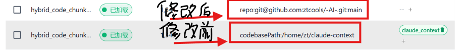

# Claude Context（二次定制版）

基于 [Zilliz/claude-context](https://github.com/zilliztech/claude-context) 二次定制开发，面向公司内部使用的代码语义索引工具。

> 原项目作者：[Zilliz](https://github.com/zilliztech)\
> 原仓库地址：<https://github.com/zilliztech/claude-context>

## 二次开发变更

- **仓库隔离策略**：将原基于本地绝对路径的集合隔离，替换为基于 `仓库 URL + 分支` 的隔离方案，实现跨机器索引复用

### 效果对比

## 快速开始

参考原项目 [README](https://github.com/zilliztech/claude-context)。

## 待办

详见 [todo.md](./todo.md)。
